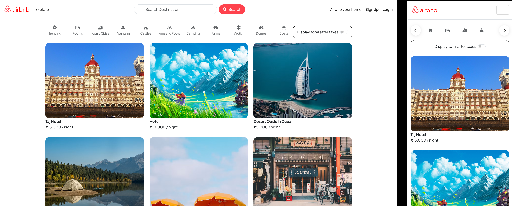

# WanderLust - Airbnb Clone

A full-stack Airbnb-inspired web application where users can browse, create, edit, and review property listings.

## Homepage

## Features

- User Authentication (Signup, Login, Logout)
- Create, Edit, and Delete Listings
- Upload Property Images
- Interactive Maps using Geoapify
- Review and Rating System
- Flash Messages and Error Handling
- Authorization and Ownership Verification
- Responsive Design using Bootstrap

## Tech Stack

### Frontend
- HTML
- CSS
- Bootstrap 5
- EJS

### Backend
- Node.js
- Express.js

### Database
- MongoDB
- Mongoose

### Authentication
- Passport.js
- Passport Local Strategy
- Express Session

### Other Packages
- Joi
- Connect Flash
- Method Override
- Multer
- Cloudinary
- Geoapify Maps API

